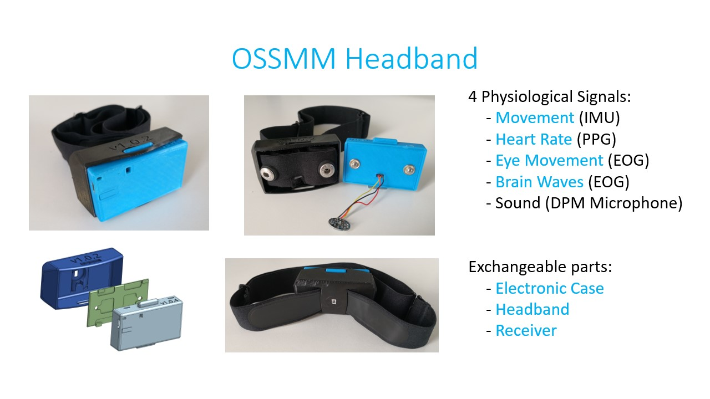

# Introduction to OSSMM and Pre-Requisites

On this page, the OSSMM system is introduced in depth. The system and headband's
functionality and capabilities are explained.

Pre-requisites for building your own are described towards the end.

# System Overview - How It All Works

The OSSMM system comprises 4 parts:

1. **The User (participant)**
2. **The OSSMM Headband **
3. **Android Device and Dedicated App **
4. **You - The Researcher **

 

  
  <figcaption style="text-align: center; font-style: italic; margin-top: 4px;">AI generated rendition of OSSMM System</figcaption>

 

Users wear the OSSMM headband each night during sleep. Version 1.0.4 of the 
headband collects head movement, eye movement (EOG), frontal brain signatures 
(EEG), and pulse (PPG) data. This data is transmitted to the dedicated OSSMM 
companion app built for Android devices. The app continually saves this data 
to local storage.

You the researcher can then collect the smartphone device and analyze the collected 
data as desired.

The OSSMM headband can be built locally with limited tools and basic electronics
knowledge. The hardware design can be modified using CAD software, and the code
for the dedicated Android app or headband can be adjusted for your use. Refer
to the [Build Your Own - What You Need to Know](#build-your-own---what-you-need-to-know)
below.

With future work it should be possible to:

1. **Have sleep data uploaded securely to the cloud for remote collection and/or backup.**
2. **Use other BLE supporting devices such as iPhone and Raspberry Pi computers.**
3. **Enable sound data collection for improved sleep analysis.**
4. **Enable near-real time sleep staging.**
5. **Use automated sleep staging or signal detection to activate stimuli for sleep modification.**

# OSSMM Headband - How it works

The OSSMM Headband comprises 3 principal components: An electronic case, a headband, and a receiver.

 

  

 

The electronic case consists of 2 3D printed parts which houses the electronics.
The headband is an adjustable strap with silicone electrodes for
EOG/EEG signal collection. These two components connect through the 3D printed
receiver made from soft filament.

 

  
  <figcaption style="text-align: center; font-style: italic; margin-top: 4px;">Open view of the three major components, all disconnected: Headband, Receiver, and Electronic Case.</figcaption>

 

  
  <figcaption style="text-align: center; font-style: italic; margin-top: 4px;">Rear view of OSSMM headband.</figcaption>

 

 

  
  <figcaption style="text-align: center; font-style: italic; margin-top: 4px;">Annotated Printables. TPE = Thermoplastic Elastomer, PLA = Polylactic Acid</figcaption>

 

# System Requirements

# Build Your Own - What You Need to Know

# Build Your Own - What You Need to Have

