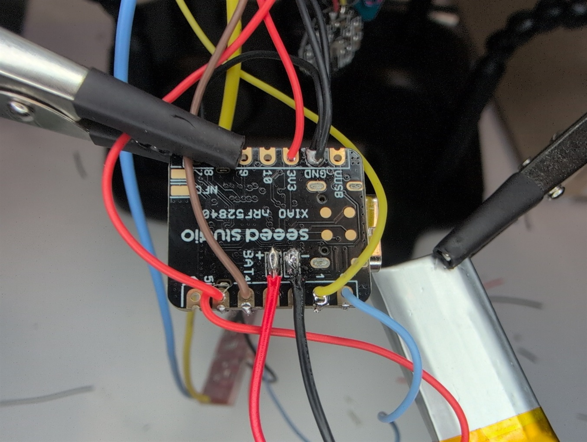

# Electronics Assembly

Welcome to the Electronics Assembly section. The goal is to combine all
the electronic components install them in the 3D
printed electronic case.

To give you an idea of what we are hoping to achieve, here are some
photos of the finished assembly. To demonstrate the interior, the lid is
left open in some of the photos. Please note how the PulseSensor is not enclosed
by the electronic case.

  
  
  

  
  

For first-time assembly, expect about 2 hours to complete.
Otherwise, assembly can be comfortably done under 50 minutes. 

**Note:** Edges may appear curved in some photos due to lens distortion 
during the documentation process. Please be aware that these edges, like the sides
of the electronic case, are actually straight.

  

## Step 1. Gather Relevant Materials:

  

**Parts:**

1. **3D Printed Electronic Case Bottom**

2. **3D Printed Electronic Case Lid**

3. **x2 Pair of 12mm Metal Snap-Fastener (2 male, 2 female)**

4. **3.7V LiPo Battery (120 -- 220mAh, not exceeding: L=32, W=15, H=6 mm)**

5. **AD8232 EKG Board**

6. **Vibration Motor Board**

7. **Pulse Sensor**

8. **Seed Xiao nRF52840 Sense (MCU)**

9. **Sheet of paper (not shown)**

  

**Required Tools:**

1. **Soldering Iron**

2. **Snap Fastener Hammer and Installation Tool**

3. **Wire Cutters**

4. **Multimeter**

  

**Recommended Tools:**

**5.  Helping Hands with Magnifier**

**6.  Fume Extractor (if not working in a ventilated environment)**

  

**Expendables:**

1. **Wires (30 AWG is recommended with color coded, silicone coating. We also recommend two 5" (13cm) thicker strands, no bigger than 22AWG. The whole project can be completed with 30AWG however)**

2. **Solder (lead free recommended)**

3. **Flux (particularly if not in solder)**

4. **Sandpaper (Recommended)**

**Preliminary notes on soldering:**

1. **Soldering temperature should be set to 380-400℃.**

2. **When using solder, especially leaded solder, use appropriate ventilation and wash hands afterwards.**

Please refer to this [Arduino documentation on
soldering](https://docs.arduino.cc/learn/electronics/soldering-basics/)
for best practices and more information.

  

## Step 2. Verify that electronic components fit inside the 3D Printed Case Bottom

 

**Goal: Ensure that the electronic case bottom and electronic components
fit together.** It is possible the case was not printed correctly, or
that components require minor modification to fit.

Refer to the photos below to determine component locations within the
case. There is no need to force components into their final position. If
the fit is tight, but you are confident the component will slot in later, then
it suffices to determine this. We are not installing the components now, only
checking sizing.

If all the components are too large, it is likely the casing did not
print to the correct dimensions and will need to be reprinted. However,
it is also possible that the Printed Circuit Boards* (PCBs) may requiring some 
trimming to fit. This can be done **carefully** with either sandpaper or the 
sharp edge of the wire cutters.

It is important that PCBs which have holes (AD8232 and Vibration Motor)
mate with the 3D printed pegs in the casing. This is a strong indicator
the electronic case bottom has printed to the correct dimensions. A
properly inserted Vibration Motor is shown in the photo below, along with
the locations of the battery and MCU.

*<u>Printed Circuit Board</u> - I use this term to refer to the components boards
such as the Seeed Xiao Sense, Vibration Motor Board, AD8232, and Pulse Sensor.

  

Please note that the Seeed Xiao Sense inserts upside down such that the
USB port will fit in the case's USB slot.

The Vibration Motor Board may need minor adjustment to fit properly. The 
vibration disk's orientation might cause wires to extend beyond the PCB 
boundaries, preventing insertion into the electronic case. Simply lift the disk
from the board (it's attached with double-sided adhesive) using wire cutters, 
reorient it so wires stay within the board dimensions, and press it back down 
gently to reattach.

The following photos highlight this issue. The left image shows the problem: 
the vibration disc orientation causes wiring to extend beyond the board's 
boundary. The right image shows the solution: rotating the disc keeps all wiring
contained within the board dimensions.

 

  
  

 

The photo below shows the inclusion of the AD8232, which should sit
above the Vibration Motor Board.

 

  

 

If the components fit, move on to the next step. Otherwise, take the
time to reprint the case or gently modify the components as needed.

  

## Step 3. Connect Snap-Fasters to the Electronic Case Lid

 

**Goal: Crimp the metal-snap-fasteners with accompanying wire leads to
the electronic case lid.** The snap-fasteners serve as the electrode
connection point for the heart rate monitor strap which collects both
EOG and EEG signals. This is essential for accurate sleep monitoring so
be patient with this step.

Cut two strands of wire (between 22-30 AWG) at least 5" long. Expose at
least 20 mm of the wires at one end. We recommend going with thicker
wire for better connection, but it is not necessary. Using larger guage
wire (here we used 22AWG) will ensure a tighter fit and better
electrical contact between the wiring and the snap-fastener.

Identify the internal face of the electronic lid. The internal face is
the one that is not smooth. With the internal face up, insert the
exposed wire through one of the round holes, keeping the wire in the
notch as shown in the photo below:

 

  

 

Then, insert one of the male snap-fasteners into the same hole.

 

  

 

Flip the electronic lid over. Bend the exposed wiring over the male snap
fastener. Trim excess wire.

 

  

 

Next, using a female snap-fastener, cover the male snap fastener **while
keeping the exposed wiring in position.** Some of the strands may move,
but if most of the wiring remains in place there should be no
issues.

 

  

 

Squeeze by hand. This should result in a tight connection where the wire
will not freely come away. Gaps between the snap-fastener and wiring
will remain as shown in the photo below. These gaps will be addressed
shortly.

 

  

 

To eliminate the gaps and ensure a tight connection we will crimp the
snap-fastener closed. Gather your installation tool and hammer.\
\
Find a corner of a hard flat surface. A corner is needed because it will
provide support beneath the snap-fastener without potentially damaging
the electronic case lid's side tabs.

 

  

 

Position the electronic case over the corner such that the corner will
support the male end of the snap fastener below but not touch the
electronic case lid elsewhere. We do not want to break off any of the
four side tabs on the electronic case lid. Place the crimping tool on
top and hammer down. Use the non-rubber side of the hammer. Do not be
afraid to use force, or to strike multiple times.

 

  

 

**Remember, the goal is to have a tight, secure fit that will not come
undone and will make solid contact with the exposed wiring.** This is
the conductive path for the EOG and EEG signals and it is essential for
accurate sleep monitoring.

Repeat the process for the other hole. Make sure the snap fasteners are
secure. Below is a complete electronic case lid with attached
snap-fasteners:

 

  

 

It is okay to have a little gap as shown below if the connection is
snug. Please note that overcrimping can lead to the wire being cut, but
if the wires are placed correctly in the notch this is unlikely.

 

  

  

## Step 4. Prepare the AD8232

 

**Goal: Begin preparing the PCBs for connection with the MCU. First PCB to prepare
is the AD8232.**

Before connecting the electronic components some additional preparation
is required. We will prepare the boards before connecting all the units
together at one. The first component is the AD8232 EKG board.

The AD8232 EKG Board comes with a 3.5mm jack which is typically used for
collecting signals. In this case, connections will be done directly to
the board's RA and LA pins, and the RL pin will remain unused.
Therefore, we will remove the 3.5mm jack otherwise the PCB will not fit
into the confines of the electronic case. *For those interested in more
information about this design choice, please refer to the section below
titled, "Additional Information on the AD8232."*

  

To remove the jack, use a pair of wire cutters to pry it off the board.
Do not be afraid to use some force.

You may desolder this if you wish as prying off the board can result in
detached electrode contacts. This only matters if you wish to reuse the
board for other uses later. After testing with multiple boards, prying
off the 3.5mm jack has always been the fastest solution and we have yet
to experience any board failures with this process.

  

Once the 3.5mm jack is removed, the AD8232 board should appear as in the
photo below:

  

  

## Step 5. Prepare the PulseSensor

 

**Goal: Prepare the PulseSensor board.**

PulseSensor units will either come soldered with pins or with wires. The
OSSMM requires wires.\
\
Even if the unit comes with wires it is recommended to switch them to
better quality silicone insulated ones. This will prolong the durability
and longevity of the device, and make later assembly easier.

 

  

 

If you have pins, it is easiest to remove the black separator then
desolder the pins one by one.

 

  

 

**Before adding new rewires note that you have a choice to add the wires
now or later.** Both options are viable, but **we found it easier to add
the wires later.** Ultimately the PulseSensor will connect to the MCU,
but the wiring must go through the rectangular slot in the electronic
case lid. This make it slightly more challenging when adding the wires
now.

In any case we show the wiring in the photo below for demonstration.
When rewiring please confirm that the order of the electrodes of S
(Signal), + (3.3V), and -- (Ground, 0V):

 

  

  

## Step 6. Prepare the Vibration Motor

 

**Goal: Prepare the Vibration Motor Board**

If the vibration motor board comes with pins these must be removed.

 

  

 

If the pins are bent, we recommend cutting below the bend, then remove
the plastic separator as shown in the photo below**. It is not
recommended to cut the pins as low as possible on the board.** They are
easiest to remove with tweezers or pliers while desoldering if there is
something to grasp.

 

  

 

The prepared board should look as the below. Nothing external protruding
over the board's boundaries, and electrode pinholes ready for wires.

 

  

  

## Step 7. Solder the components together according to the Layman's schematic

 

**Goal: Assemble all the components!**

It is now time to assemble all the components with wires! Refer to the
Layman's schematic below for the connections. We will show step by step
soldering photos further below:

 

  

 

**Before proceeding, please note the following:**

1.  Wires should come out of the bottom of the MCU board

2.  Side connections of the AD8232 board (GND, 3.3v, Output) come out of
    the bottom of the board, the side opposite that with the 3.5mm jack.

3.  Top connections of the AD8232 board (RA, LA) come out of the top,
    the side that had the 3.5mm jack.

4.  Wires can be soldered for either side of the Vibration Motor Board.
    The top is prefered.

5.  When soldering the PulseSensor to the MCU, **remember to insert the
    wires through rectangular slot of the electronic case lid first!**

All of these will be remphasized later.

There are many ways to go about the soldering process according to the
schematic above. We relate here the method that we found easiest:

First, start with the MCU and solder all wired connections to
appropriate pin holes

. It is easiest to hang the wires through the MCU pin slots, then
solder. Shown below is this process for connecting the triple ground
wire for each of the boards, and a 3.3V wire for the Vibration Motor
board. We highlight again, wires should come out of the bottom of the
board:

 

  

 

Once the connections are soldered, trim off any excess wires as shown
below for the red 3.3V line.

 

  

 

Now we connect the wiring for the other side of the board. Again we
thread the wiring through the pin holes, bend the wires so they hold
themselves.

 

  

 

Solder these connections then trim any excess.

We highlight again here that the wires for the PulseSensor must go
through the rectangular slot in the electronic case lid. If you forget
to do this, it simply requires desolder, moving the wires through the
slot, then resoldering. We recommend doing this on the PulseSensor if
needed as the pin holes on the MCU are very small and not conducive to
easy resoldering.

Here is an example photo of the PulseSensor with wires, not yet
connected to the MCU, but with the wires properly slotted through the
electronic case lid.

 

  

 

Please fully connect the PulseSensor to the MCU now.

Next we will connect the Vibration Motor Board as shown below:

 

  

 

Finally, we will connect the AD8232 EKG Board. We sill start with the
side connections for GND, 3.3V, and OUTPUT. Here we remind again that
these wires should come out from the bottom of the board. We hang the
wires through the pin holes.

 

  

 

Next we solder and clean the connections by snipping off any excess
wire.

 

  

 

In a similar manner, we now solder the RA and LA connections. Note, the
wires for this connection are those remaining from the electronic case
lid. These two wires are for our EOG / EEG signals. Notice the thicker,
yelow and blue wires we used in this tutorial for this section. It does
not matter which wire goes into LA or RA. We note here again that the
wire from the top connections emerge from the top of the board.

 

  

  

## Step 8. Connect the Battery

 

**Goal: Connect the Battery!**

Now it's time to connect the battery.\
\

  ⚠️ CRITICAL SAFETY CHECK ⚠️

  <b>IMPORTANT: YOU MUST VERIFY BATTERY LEAD POLARITY WITH MULTIMETER</b>

  - RED should be POSITIVE (+)
  - BLACK should be NEGATIVE (-)

  <b>CAUTION:</b> Some manufacturers reverse this standard color coding.

  <b>⚠️ CONNECTING INCORRECT POLARITY WILL PERMANENTLY DAMAGE THE MCU ⚠️</b>

  With the polarity of the battery leads verified, <b>carefully solder the leads to the MCU battery contacts</b> as shown in the photo below. Here RED is positive, and BLACK is negative.

 

  

 

Accidentally soldering the leads to the wrong location (such as positive
to negative) will likelydamage your board. The extent of the damage may
vary, but if this occurs the MCU should not be trusted even if it
appears to function.\
\
Our testing has shown that sometimes the MCU will semi-function, but
other errors may present themselves in time, such as the MCU being
incapable of charging the battery.

  

## Step 9. Install the components into the Electronic Case Bottom

 

**Goal: Slot all electronic components and wiring into the electronic
case bottom.**

Now that everything is connected, it's time to install the electronics
into the case bottom.

First, position the case bottom so you're looking into it. Verify the
version number (printed on the side) is in the upper left corner. The
MCU slot should be in the upper right corner.\
\
Install the MCU (upside down), the battery, and Vibration Motor Board.
Loop the Vibration Motor Bord wires around the upper right peg as shown
below:

 

  

 

Next, install the AD8232 Board into position. The side pins should be
located over the center of the electronic case, and the EOG/EEG (RA/LA)
pins should be towards the bottom left corner.

 

  

 

If the MCU is overly loose in its slot, we recommend covering it with
folded paper as shown in the figure below to ensure it remains in its
slot during use. Please note the following photos show a separate OSSMM
device printed in blue, and with 30AWG wiring for the EOG/EEG
electrodes.

 

  

 

We also recommend installing one sheet of paper cutout as shown in the
photo below over the circuits. This provides an insulative barrier from
the metal snap-fastener electrodes and eliminates any possibility of
shorting with the underlying PCBs.

 

  

  

## Step 10. Close the Electronic Case

 

**Goal: Close the case and finish!**

Now it's time to close the electronic case. Note that the tabs on the
electronic case lid are asymmetrical. It can only be closed in one way!

Before inserting, make sure the respective slots on the electronic case
bottom are free and clear. Remove any debris or support material which
may remain.\
\
Align the tabs, insert on one side, then insert on the other. This may
require some slight bending of the electronic case base wall to all the
tabs to slip into their slots.

When it is finished it should look like the following:

Back:

  

Front:

  

Side with USB-C:

  

  

## Step 11. Now it's time for full assembly!

 

Refer to the assembly guide on how to combine the heart monitor strap,
receiver and electronic case together! You're nearly finished!

**[Final Assembly & Completion](04-final-assembly.md)**: Integrating the electronics into the casing and attaching the headband.

or return to the main page:

**[Main Page](index.md)**

  

## Additional Information on the AD8232

 

*Regarding the removal of the 3.5mm jack, one of the project goals was
to minimize the size and weight of the OSSMM device. Under this lens,
the 3.5mm jack provides no benefits and consumes precious space
resources.*

*For those familiar with the AD8232, no connection to the RL pin indeed
means the Right Leg Drive Amplifier (RLD) is not used. Typically, the
RLD applies a small current which is inverse to the signal commonly
detected by both the RA and LA electrodes. Because the AD8232 acts as a
differential amplifier in this case, applying the inverse of the common
signal improve improves the Common-Mode Rejection Ratio, or in short,
improves the Signal to Noise Raise (SNR) of the signal difference
between the electrodes.*

*We accept the trade-off of reduced signal quality by abandoning the RLD
for two principal reasons: perceived safety and constructability. Having
any current applied to the body, particularly the head, is considered
invasive and therefore makes any risk however infantisemly negligible\*,
non-zero. Furthermore, the requirement for a third electrode to supply
this current to the body increases device costs and device complexity.
The perfomance of the OSSMM without the RLD is more than sufficient to
gladly accept this trade-off.\
\
\*To be very clear on how safe the RLD already is, please consider the
following: The AD8232 EKG board in its standard "Cardiac Monitor
configuration," which is used here prior to "safety" modification, is
set with an "RL" output resistor of 360kΩ limiting the output current to
a participant's body of ≤ 10 µA, provided the PCB voltage is 3.3V. In
the worst case scenarion, even if the voltage were raised to 4.2V (i.e.
directly powered by a fully charged 3.7V LiPo battery, which it is not)
and the resistor had the lowest value within the ±10% tolerance range
(that is 324 KΩ), the maximum current would be 13 µA. In comparison,
tACS and tDCS devices supply current to a participants head of up to
2mA, or more than 150x the worst case scenario of the AD8232. However,
given that there is still a "risk" using the RLD, this would needlessly
complicate Health&Safety assesments and ethics approval.*