# Electronics Assembly

Welcome to the Electronics Assembly guide! In this section, you will learn how 
to combine the electronic components and install them in the 3D printed case 
to create the "electronic module." 

The photos below show the completed assembly from different angles. Some images 
display the case with the lid open to reveal the internal component arrangement.
Please note that the PulseSensor intentionally remains outside the electronic 
case in the final assembly.

For first-time builders, expect to spend about 2 hours on this process. 
Experienced builders can complete the assembly comfortably in under 50 minutes.

  
  
  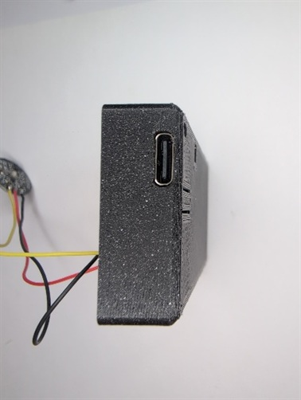

  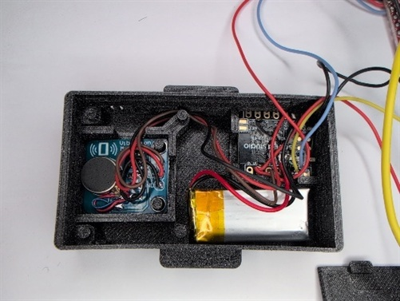
  

**Note:** Edges may appear curved in some photos due to lens distortion 
during the documentation process. Please be aware that these edges, like the sides
of the electronic case, are actually straight.

  

## Step 1. Gather Relevant Tools and Materials:

  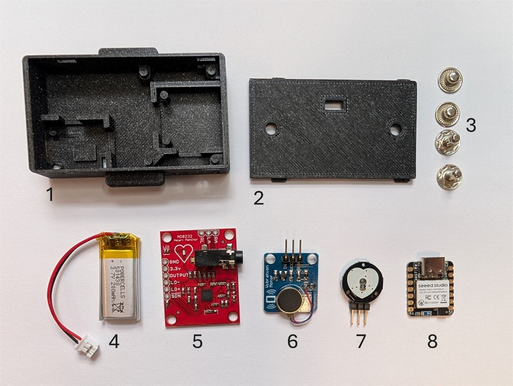

**Parts:**

1. **3D Printed Electronic Case Bottom**

2. **3D Printed Electronic Case Lid**

3. **x2 Pair of 12mm Metal Snap-Fastener (2 male, 2 female)**

4. **3.7V LiPo Battery (120 -- 220mAh, not exceeding: L=32, W=15, H=6 mm)**

5. **AD8232 EKG Board**

6. **Vibration Motor Board**

7. **Pulse Sensor**

8. **Seed Xiao nRF52840 Sense (MCU)**

9. **Sheet of paper (not shown)**

  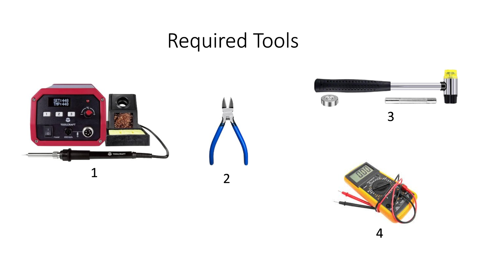

**Required Tools:**

1. **Soldering Iron**

2. **Snap Fastener Hammer and Installation Tool**

3. **Wire Cutters**

4. **Multimeter**

  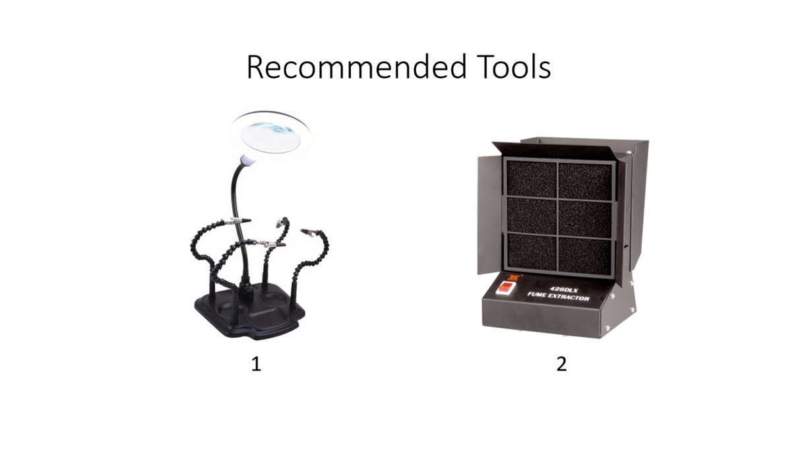

**Recommended Tools:**

**5.  Helping Hands with Magnifier**

**6.  Fume Extractor (if not working in a ventilated environment)**

  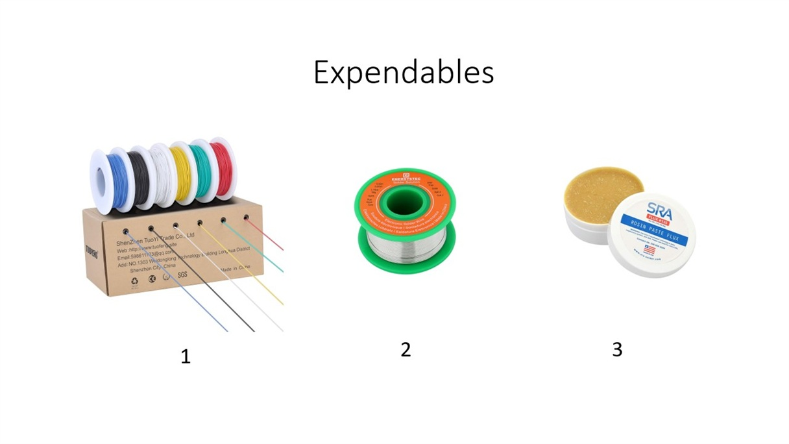

**Expendables:**

1. **Wires (30 AWG is recommended with color coded, silicone coating. We also recommend two 5" (13cm) thicker strands, no bigger than 22AWG. The whole project can be completed with 30AWG however)**

2. **Solder (lead free recommended)**

3. **Flux (particularly if not in solder)**

4. **Sandpaper (Recommended)**

**Preliminary notes on soldering:**

1. **Soldering temperature should be set to 380-400℃.**

2. **When using solder, especially leaded solder, use appropriate ventilation and wash hands afterwards.**

Please refer to this [Arduino documentation on
soldering](https://docs.arduino.cc/learn/electronics/soldering-basics/)
for best practices and more information.

  

## Step 2. Test-Fit Electronic Components in 3D Printed Case Bottom

 

**Goal: Verify that all electronic components properly fit into the 3D printed case bottom.**

In this step, you'll test if your components fit correctly in the case.

Refer to the photos directly below to identify the position of each component. 
Don't force anything into place at this stage—we're only checking fit, not 
installing components permanently.

If components appear too large:
1. Check if the case was printed to correct specifications
2. If the case dimensions are correct, then some PCBs* may need minor adjustments
3. Carefully sand edges of PCBs using sandpaper or scrape with wire cutters (use caution!)

**Important fit check:** The AD8232 and Vibration Motor boards have holes that 
should align with the pegs in the case. This alignment should confirm proper case 
dimensions.

*PCBs (Printed Circuit Boards) refer to the component boards such as the Seeed 
Xiao Sense, Vibration Motor Board, AD8232, and Pulse Sensor.

The photo directly below shows a properly positioned Vibration Motor,
along with the designated positions for the battery and MCU.

  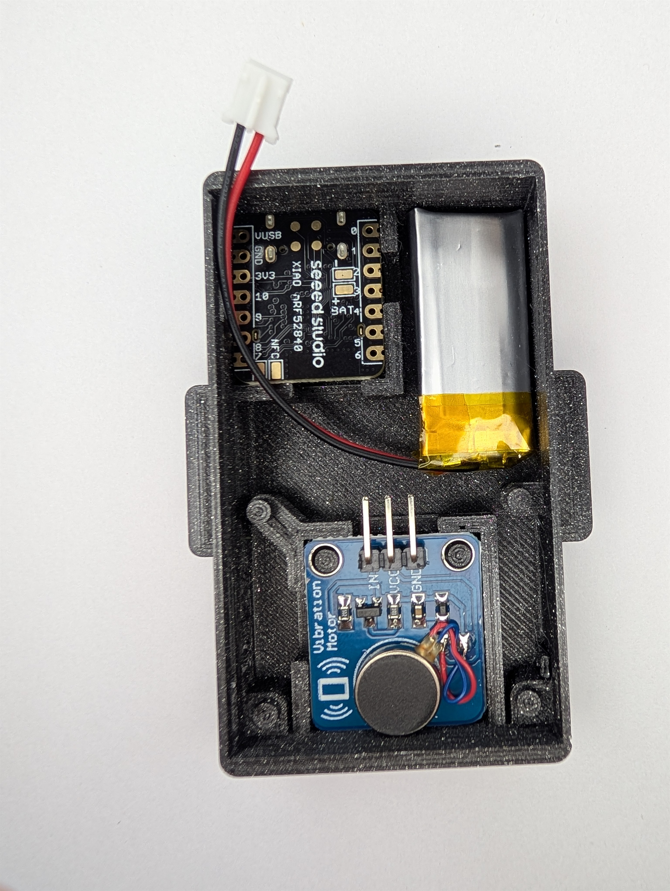

Please note that the Seeed Xiao Sense inserts bottom-side facing up, so that the
USB port insert into the electronic case's USB slot.

The Vibration Motor Board may need minor adjustment to fit properly. The 
vibration disk's orientation might cause wires to extend beyond the board's 
boundaries, preventing insertion into the electronic case. Simply lift the 
vibration disk from the board (it's attached with double-sided adhesive) using 
the wire cutters or your fingers, reorient it so wires stay within the board 
dimensions, and press it back down gently to reattach.

The following photos highlight this issue. The left image shows the problem: 
the vibration disc orientation causes wiring to extend beyond the board's 
boundary. The right image shows the solution: rotating the disc keeps all wiring
contained within the board dimensions.

 

  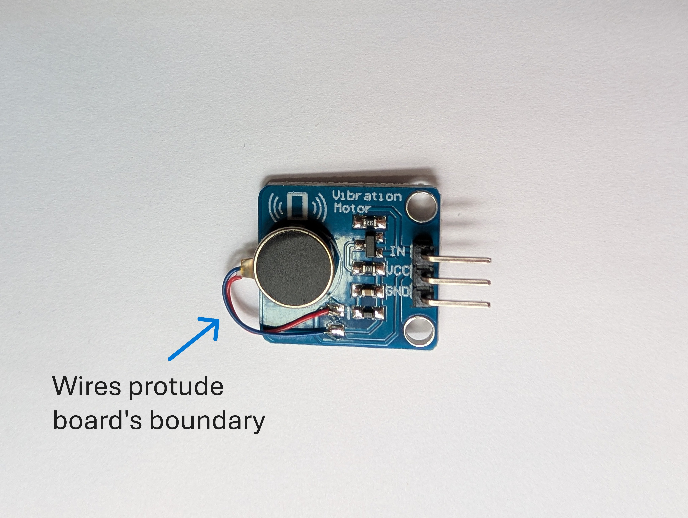
  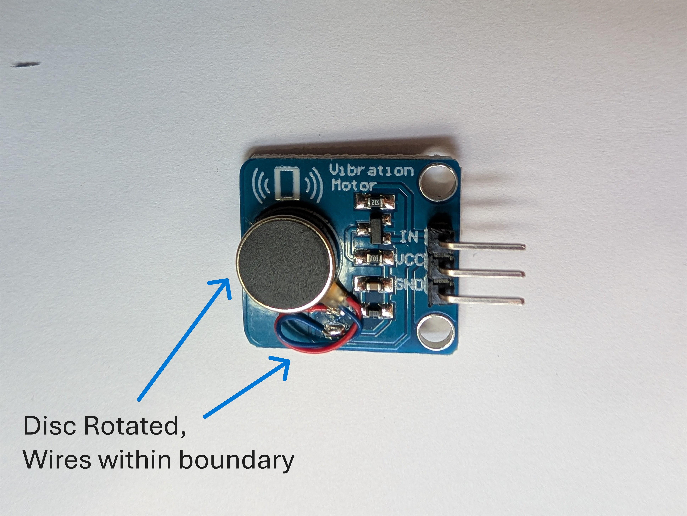

 

The photo below shows the inclusion of the AD8232, which should sit
above the Vibration Motor Board.

 

  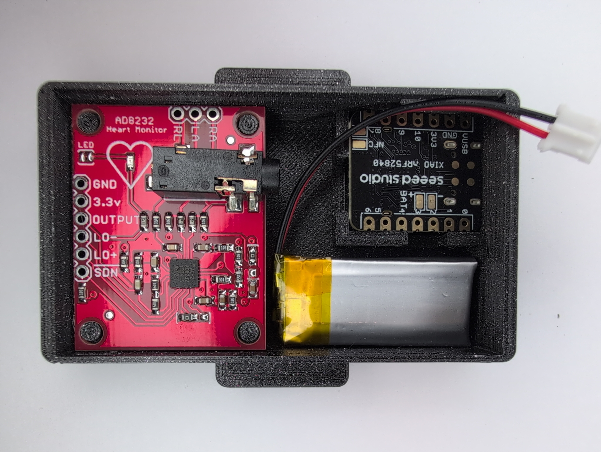

 

If the components fit, move on to the next step. Otherwise, take the
time to reprint the case or gently modify the PCBs as needed.

  

## Step 3. Connect Snap-Fasters to the Electronic Case Lid

 

**Goal: Install Snap-Fasteners on the Electronic Case Lid with Wire Leads**

The snap-fasteners function as electrode connection points for the heart rate 
monitor strap, which collects EOG and EEG signals. This connection is essential
for accurate sleep monitoring. Take your time with this step.

Materials needed:
- Two wire strands (22-30 AWG), at least 5" (13cm) long
- Thicker wire (22 AWG recommended) provides better electrical contact

Preparation steps:
1. Strip approximately 20-25mm of insulation from one end of each wire
2. Locate the internal face of the electronic lid (the non-smooth surface)
3. With the internal face up, thread the exposed wire through one of the round holes
4. Position the wire carefully in the notch as shown in the photo below:

 

  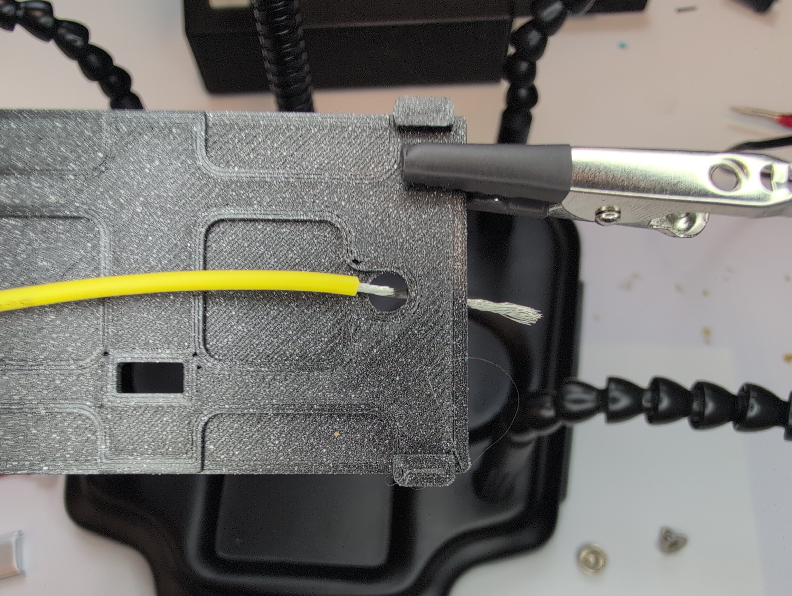

 

Then, insert one of the male snap-fasteners into the same hole.

 

  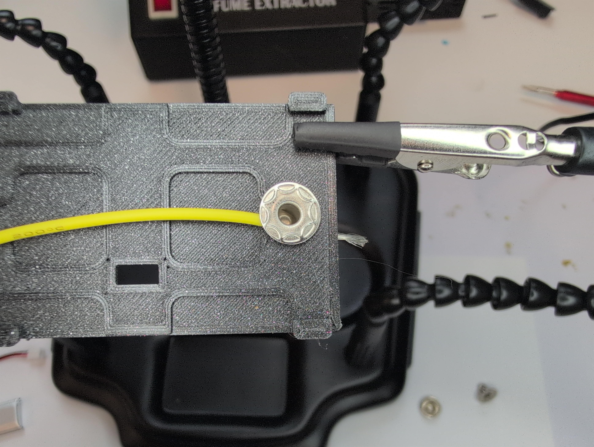

 

Flip the electronic lid over. Bend the exposed wiring over the male snap
fastener. Trim excess wire.

 

  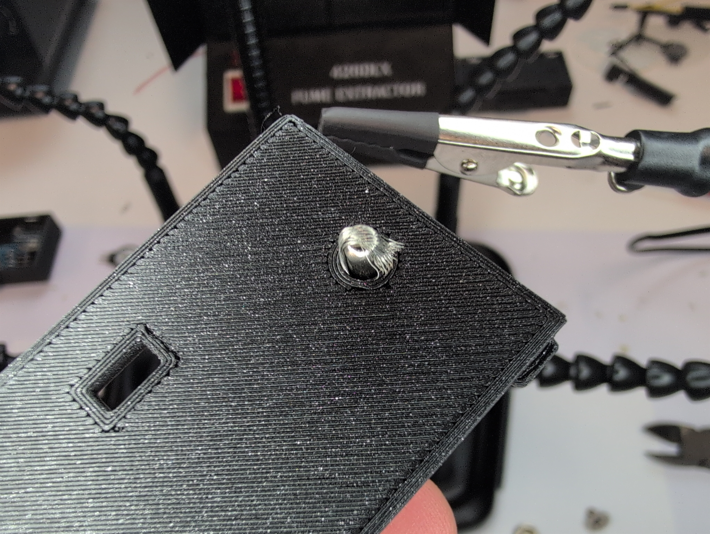

 

Next, place a female snap-fastener over the male snap fastener **while 
maintaining the exposed wire's position**. It's normal for some wire strands to
shift slightly during this process—as long as most of the wiring stays in place, 
the connection will function properly.

 

  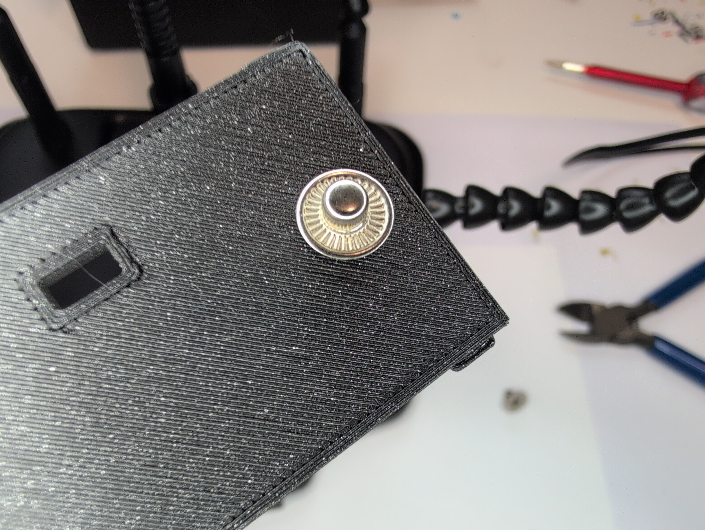

 

Press the snap-fastener assembly together firmly by hand. This creates an initial
connection that prevents the wire from easily pulling free. You'll notice small
gaps between the snap-fastener assembly (as shown in the photo below). Don't 
worry — we'll address this in the next step.

 

  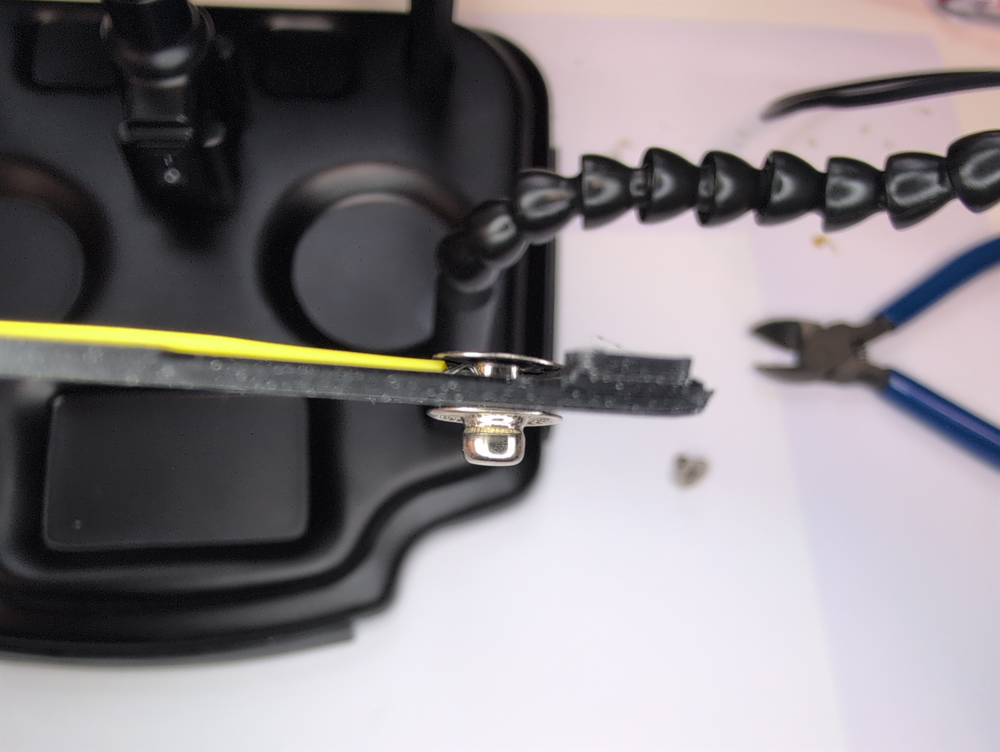

 

To close these gaps and create a secure electrical connection, we'll now properly
crimp the snap-fastener. Gather your snap-fastener installation tool and hammer.

Find a sturdy corner of a hard, flat surface for this step. Using a corner is 
important as it provides targeted support directly under the snap-fastener while 
keeping the electronic case lid's side tabs free from pressure that could damage
them.

 

  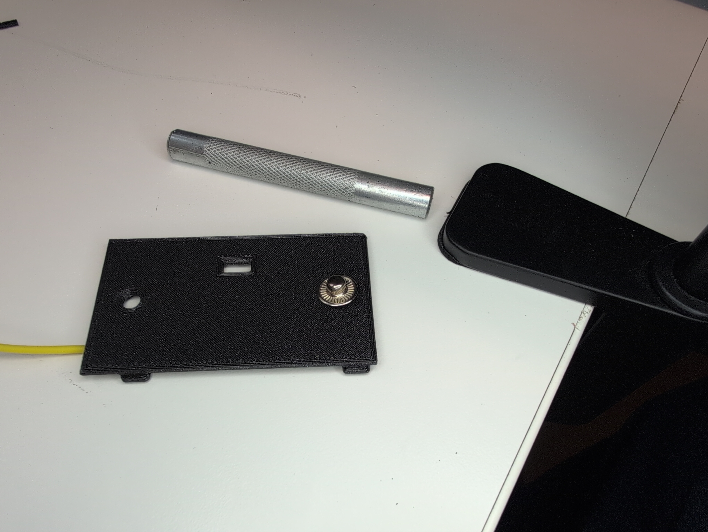

 

First, verify the wire remains in the notch on the internal face. Then position the 
electronic case over the corner so that only the male end of the snap fastener
receives support from below, without the corner touching any other part of the 
case lid. This positioning will prevent any damage to the four side 
tabs on the lid.

Place the crimping tool directly on top of the snap fastener and strike firmly 
with the non-rubber side of the hammer. Don't hesitate to use sufficient force 
or multiple strikes to achieve a proper crimp—this connection needs to be secure.

While it is possible to over crimp the snap fastener and cut the wire, this is
difficult to achieve if the wire is positioned in the notch from the start.

 

  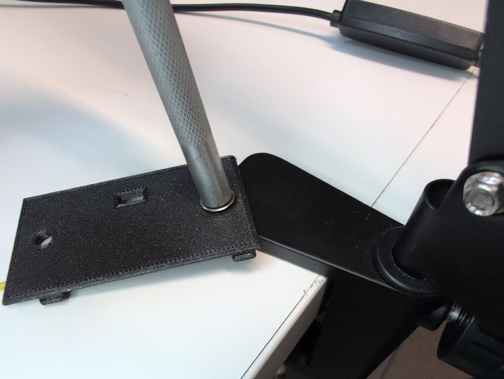

 

**Remember, the goal is to have a tight, secure fit that will not come
undone and will make solid contact with the exposed wiring.** This is
the conductive path for the EOG and EEG signals and it is essential for
accurate sleep monitoring.

Repeat the process for the other hole. Make sure the snap fasteners are
secure. Below is a complete electronic case lid with attached
snap-fasteners:

 

  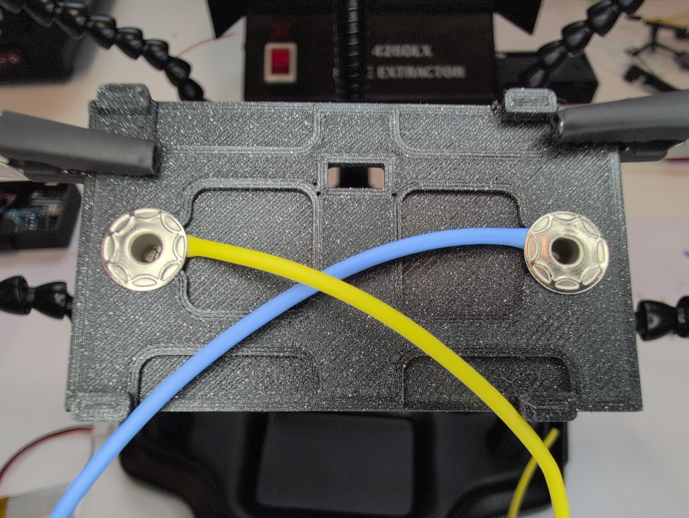

 

It is okay to have a little gap as shown below if the connection is
snug. Again note that over crimping can lead to the wire being cut, but
if the wires are placed correctly in the notch this is unlikely.

 

  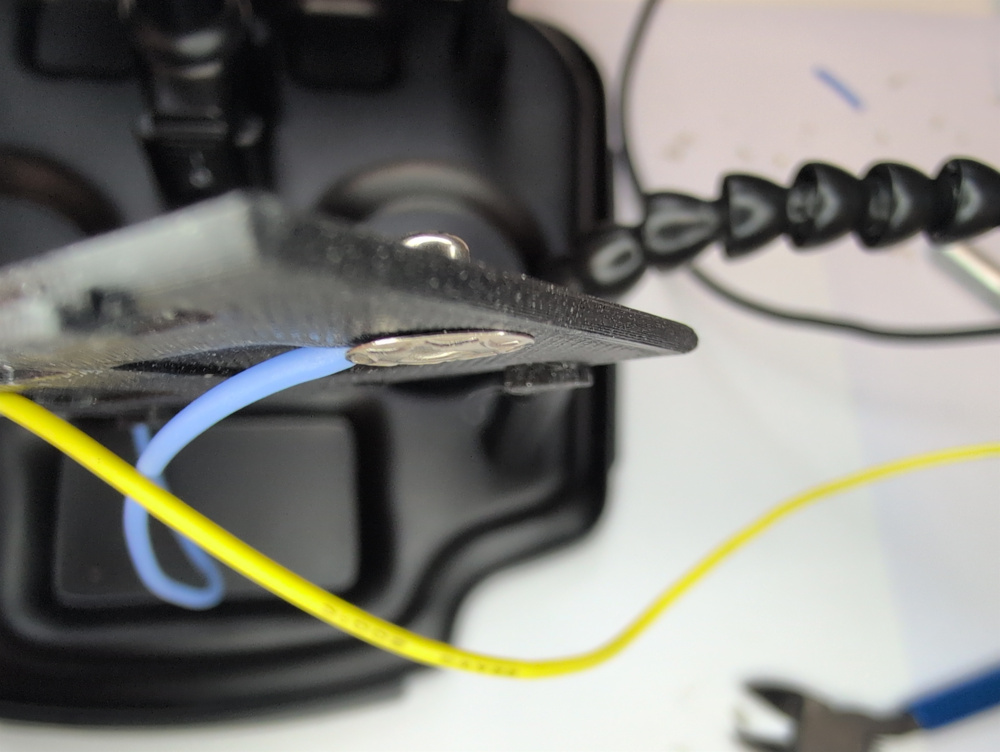

  

## Step 4. Prepare the AD8232

 

**Goal: Begin preparing the PCBs for connection with the MCU. First PCB to prepare
is the AD8232.**

Before assembling all components together, each circuit board may require 
some preparation. We'll start with the AD8232 EKG board.

The AD8232 EKG board includes a 3.5mm headphone jack that we won't be using in
our design. Since we'll connect directly to the board's RA and LA pins 
(leaving the RL pin unused), this jack must be removed to allow the board to fit
properly inside the electronic case.

*For those interested in more information about this design choice, please refer
to the section below titled, 
[Additional Information on the AD8232](#additional-information-on-the-ad8232) below*

  

**Quick Method:** Use wire cutters to firmly pry the jack off the board. Don't
hesitate to apply reasonable force.

**Alternative Method:** If you plan to repurpose this board later, consider 
desoldering the jack instead. Prying may occasionally detach electrode contacts,
though this won't affect our current application.

**Note on Reliability:** We've tested this removal method on numerous boards and
found prying to be both quick and reliable, with no board failures to date.

  

Once the 3.5mm jack is removed, the AD8232 board should appear as in the
photo below:

  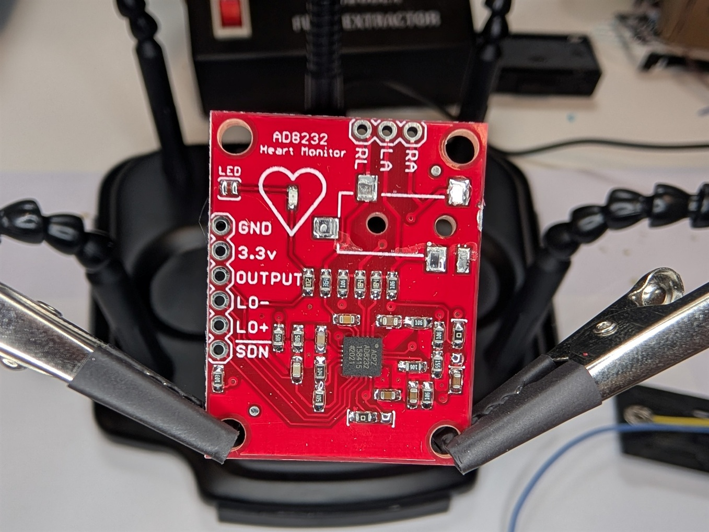

  

## Step 5. Prepare the PulseSensor

 

**Goal: Prepare the PulseSensor board.**

PulseSensor units will either come soldered with pins or with wires. The
OSSMM requires wires.

Even if the unit comes with wires it is recommended replacing them with 
high-quality silicone-insulated wires. This will prolong the durability
and longevity of the device, and make later assembly easier.

Note: Future designs may permit the PulseSenor to only require pins. Wires coming
from the MCU could terminate with female Dupont connectors which would mate with
these pins. This would have several benefits. However, the current design does
not lend itself to this. 

 

  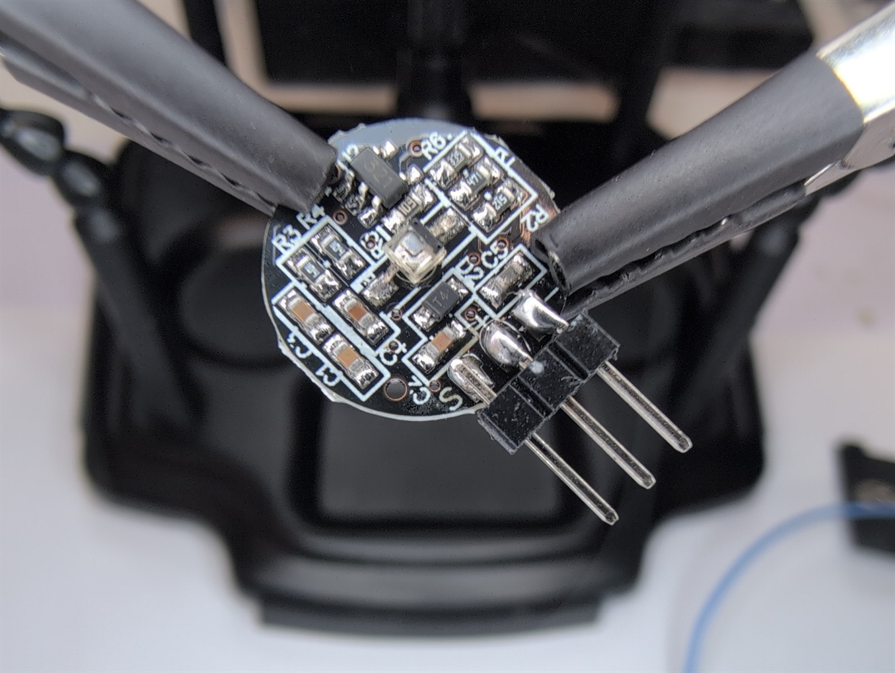

 

If you have pins, it is easiest to remove the black separator then
desolder the pins one by one.

 

  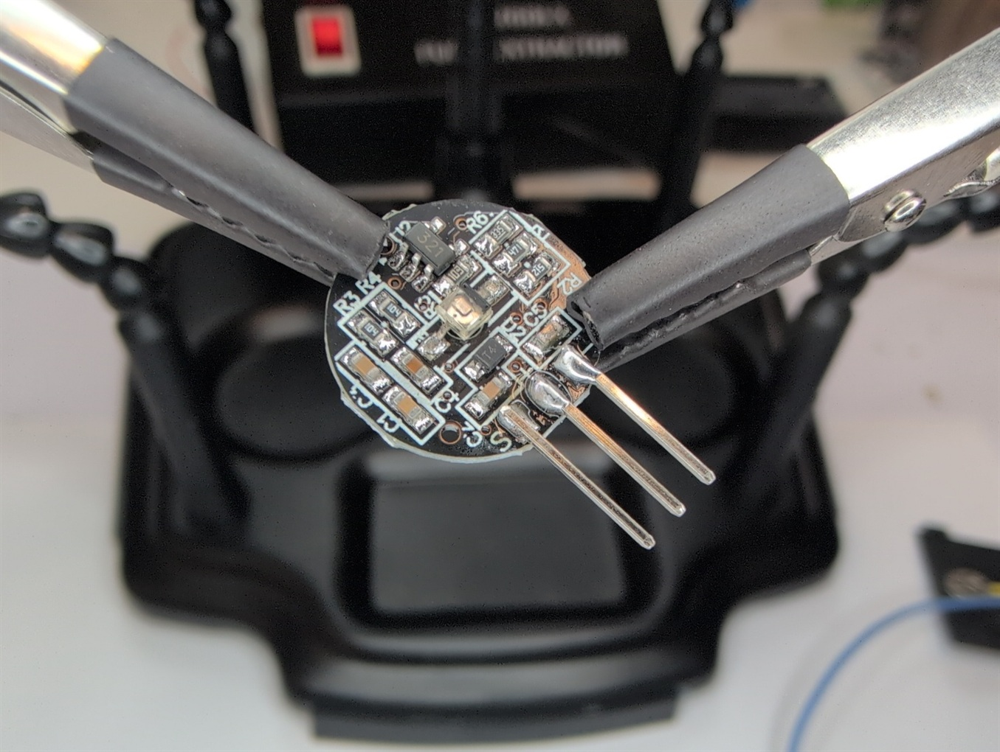

 

**Wiring Decision:** You can add wires to the PulseSensor nor or later.

Both approaches work, but **we recommend adding the wires later.** The 
PulseSensor's wires must pass through the rectangular slot in the electronic 
case lid. Adding the wires earlier makes the soldering more challenging.  

Regardless of when you choose to add the wires, the photo below shows the
correct wiring configuration. When rewiring please confirm that the order of the
electrodes of: 

* **S** (Signal)
* **+** (3.3V)
* **--** (Ground, 0V):

 

  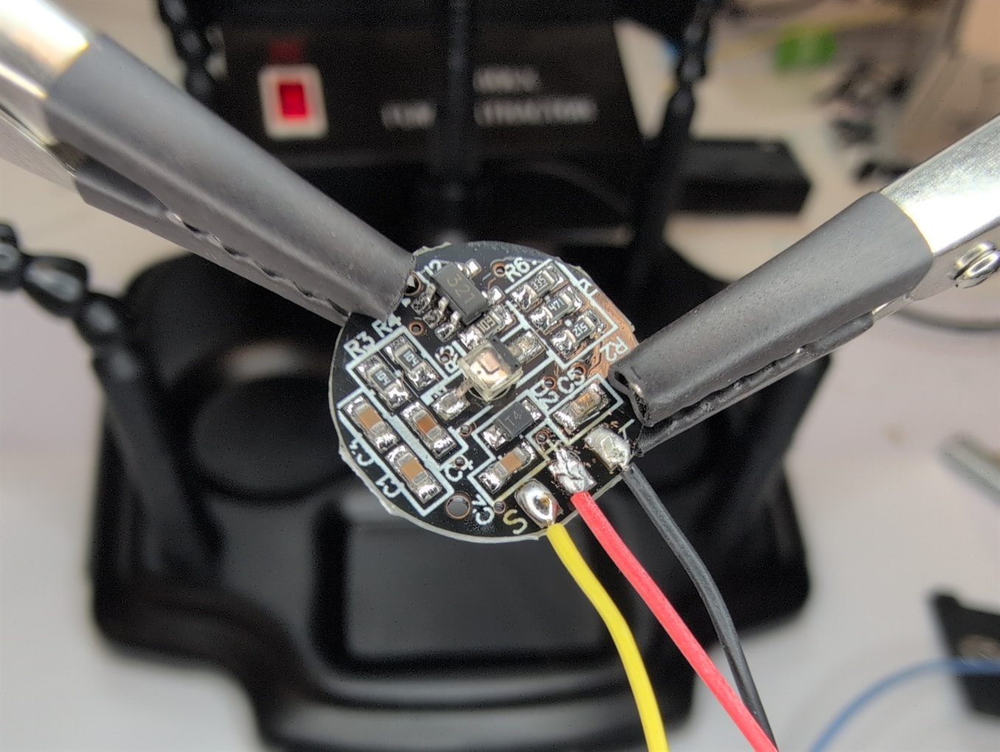

  

## Step 6. Prepare the Vibration Motor

 

**Goal: Prepare the Vibration Motor Board**

If the vibration motor board comes with pins these must be removed.

 

  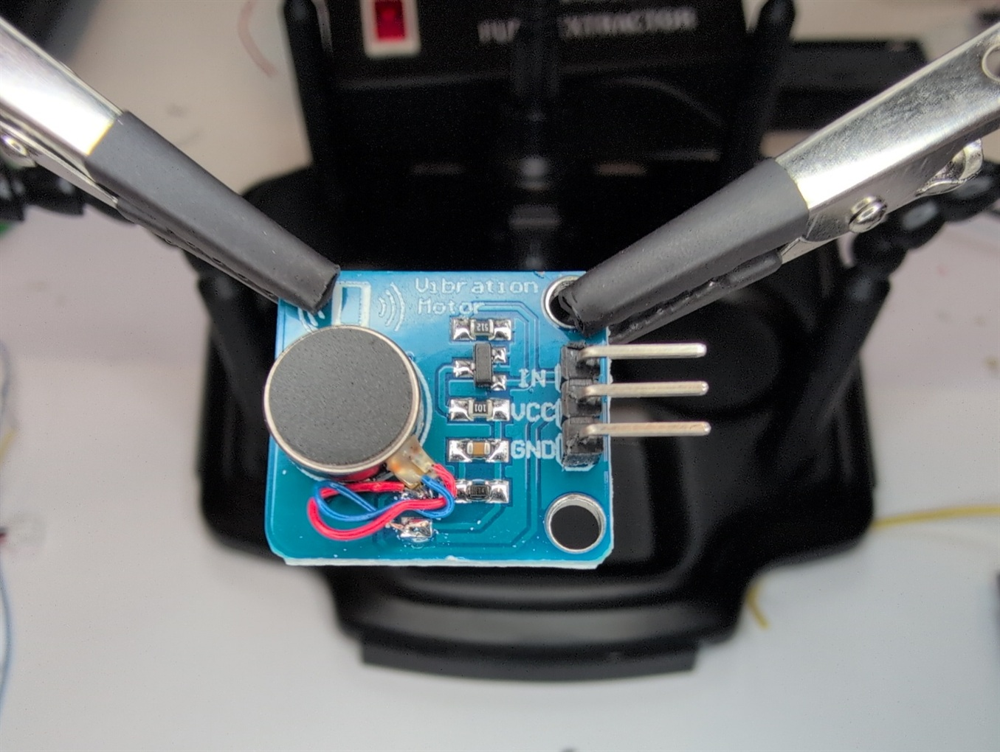

 

If the pins are bent, we recommend cutting below the bend, then remove
the plastic separator as shown in the photo below**. It is not
recommended to cut the pins as low as possible on the board.** They are
easiest to remove with tweezers or pliers while desoldering if there is
something to grasp.

 

  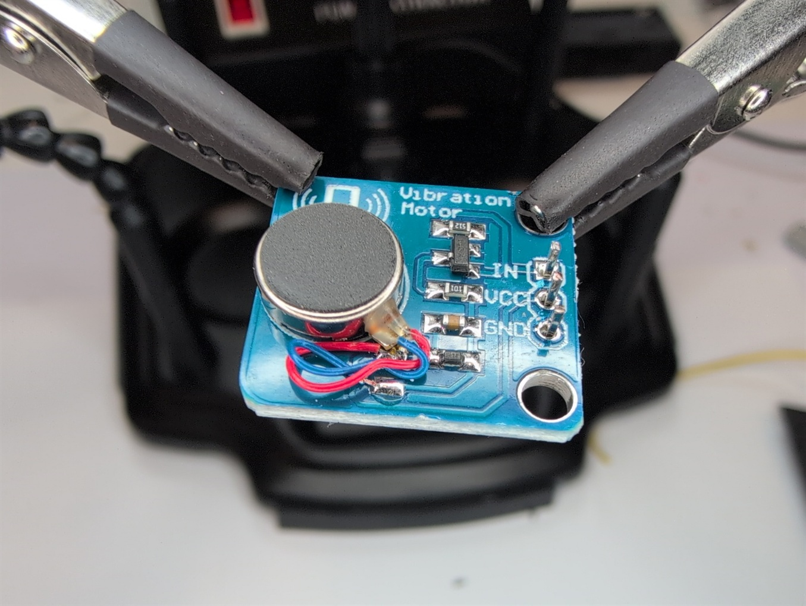

 

The prepared board should look as the below. Nothing external protruding
over the board's boundaries, and electrode pinholes ready for wires.

 

  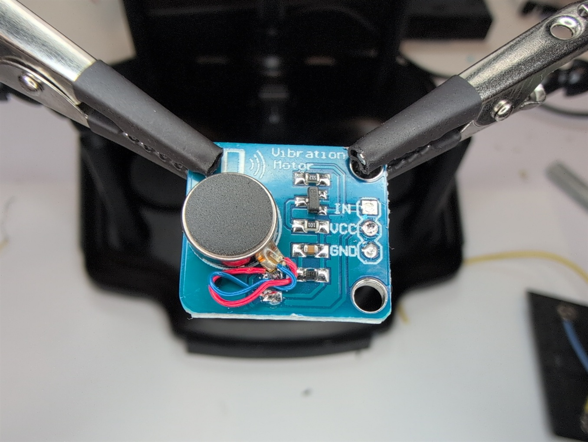

  

## Step 7. Solder Components Together According to the Layman's Schematic

 

**Goal: Assemble all the components!**

It is now time to assemble all the components with wires! Refer to the
Layman's schematic below for the connections. We will show step by step
soldering photos further below:

 

  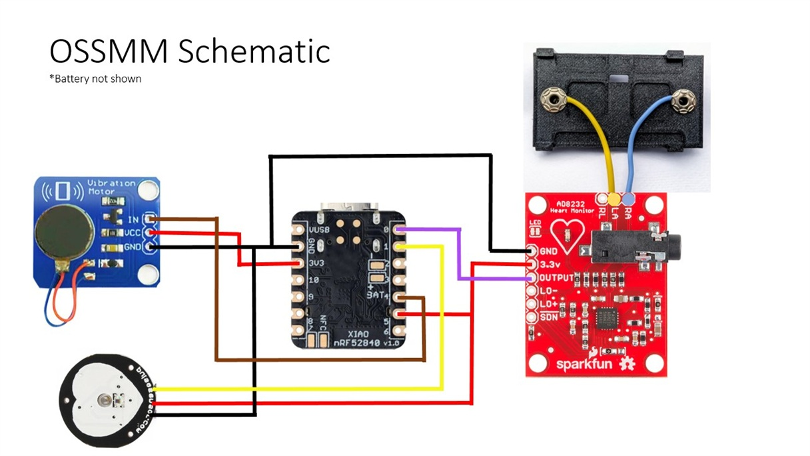

 

**Before proceeding, please note the following:**

1.  **MCU:** All wires exit from the bottom face of the board.

2. **AD8232 Board**: 
  - Side Pins (GND, 3.3V, Output): Wires exit from the bottom side (opposite face of the 3.5mm jack).
  - Top Pins (RA, LA): Wires exit from the top side (face with 3.5mm jack).

3. **Vibration Motor Board**: Wires can exit from either side. Top side is preferred.

4. **PulseSensor**: If you have soldered wires to the PulseSensor, remember to thread the wires through the rectangular slot in the electronic case lid before soldering to the MCU!

We will remind you of these again later in the tutorial.

There are many ways to go about connecting the components with the schematic 
above. We relate here the method we've found most reliable and efficient:

Begin by soldering all required wires to the appropriate pins on the MCU board:

1. Thread each wire through its designated pin hole from the bottom side of the board
2. Bend the wire on the top side to hold it in place
3. Solder each connection securely
4. Trim and clean off any excess

Shown below is the first and second step of this process. Here we have threaded
a red wire through the 3.3V pin of the MCU which will later power the Vibration
Motor. Already soldered are the three ground wires for the component PCBs.

We highlight again, upon completion wires must emerge from bottom of the board:

 

  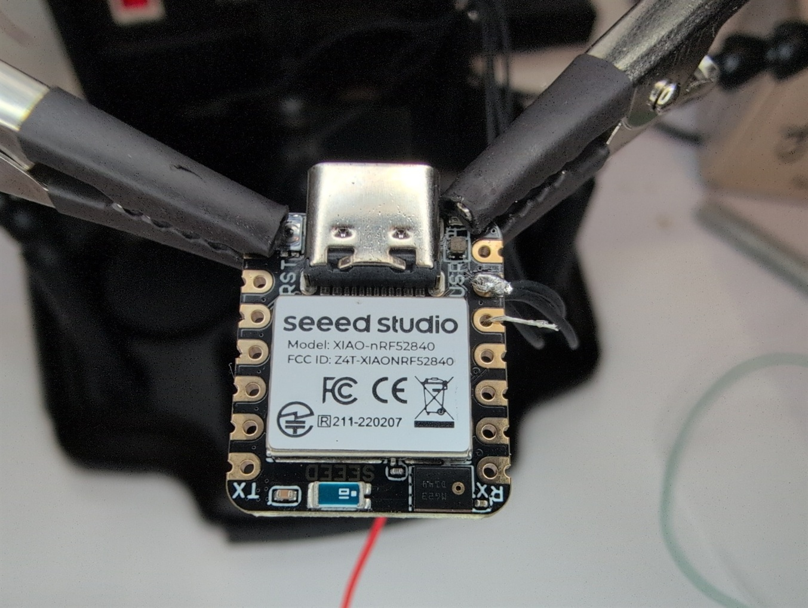

 

Now it is time to solder the bent wire, and trim off any excess. Resoldering may
be done for a cleaner job.

 

  

 

Now you should connect the wiring for the other side of the board as shown below.
Refer to the schematic if there is any confusion. Again we have threaded the
wiring through the pin holes and bent the wires so they hold themselves.

 

  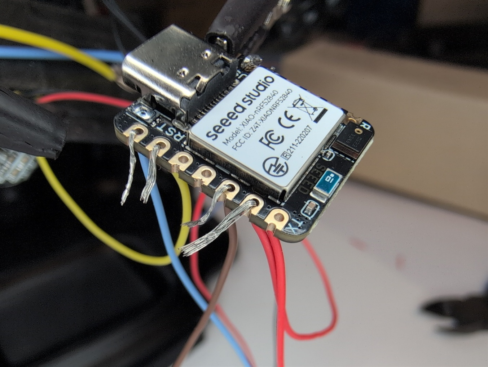

 

Solder these connections then trim any excess.

Now it is time to complete the connection between the MCU and the PulseSensor.

We highlight again here that the wires for the PulseSensor must go
through the rectangular slot in the electronic case lid. If you forget
to do this, don't worry. Simply desolder the connections on the PulseSensor, 
thread the wires correctly, then resolder.

We do not recommend resoldering the connection from the MCU side as the pins are
very small and not conducive to easy resoldering.

Below is an example demonstrating the PulseSensor with wires properly threaded
through the rectangular slot in the electronic case lid. Again this photo is for
illustrative purpose and we recommend connecting the PulseSensor to the wires
after they have already been attached to the MCU.

 

  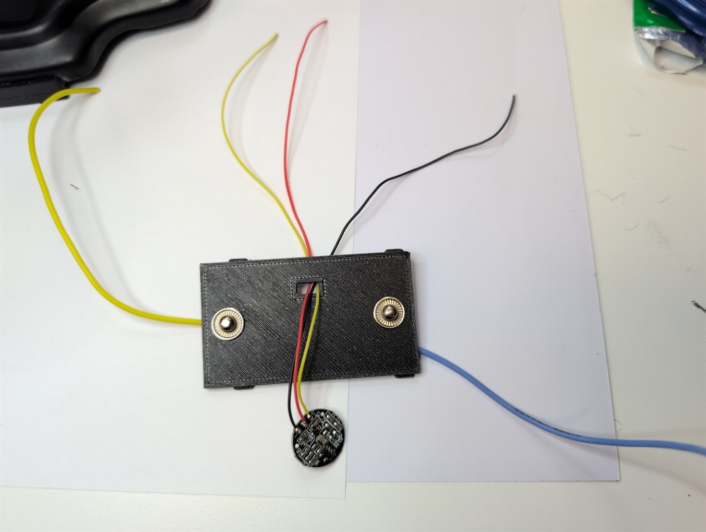

 

Please fully connect the PulseSensor to the MCU now.

Now you will connect the Vibration Motor Board as shown below:

 

  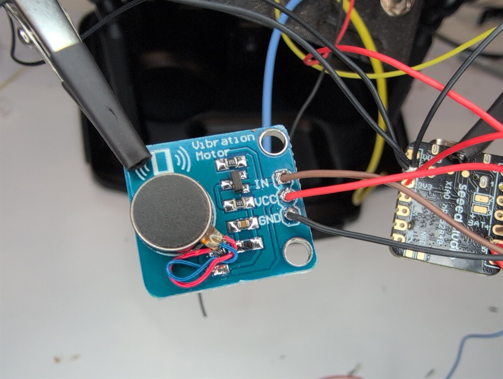

 

Finally, connect the AD8232 EKG Board. Start with the side connections 
(GND, 3.3V, and OUTPUT). Remember that these wires must exit from the bottom of 
the board (the side opposite where the 3.5mm jack was removed). Thread the wires
through the pin holes as shown in the image below.

 

  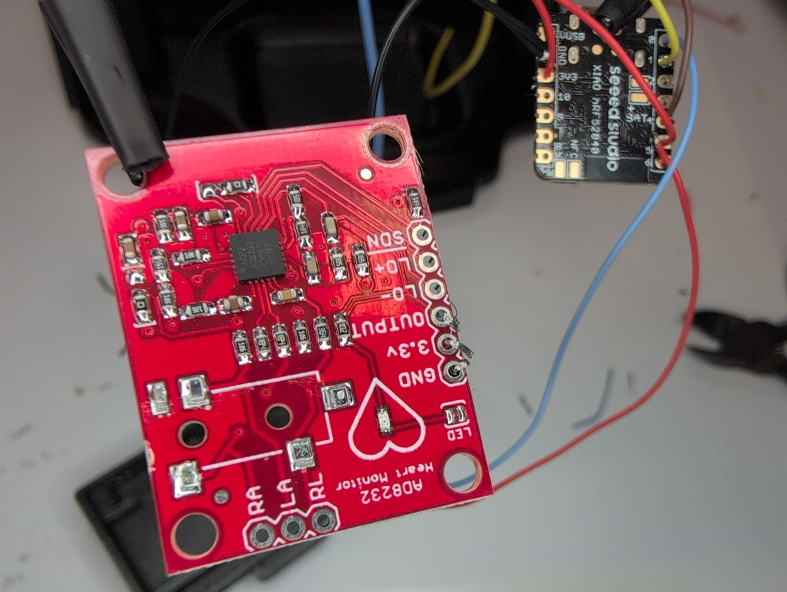

 

Next solder then clean the connections by snipping off any excess.

 

  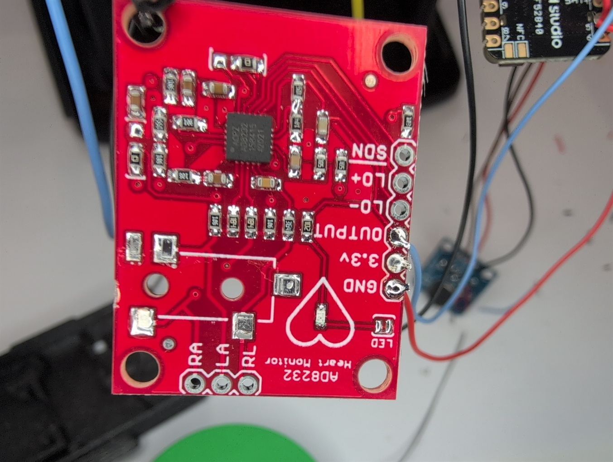

 

In a similar manner, we now solder the RA and LA connections. Note, the
wires for this connection are those remaining from the electronic case
lid. These two wires are for our EOG / EEG signals. Notice the thicker,
yelow and blue wires we used in this tutorial for this section. It does
not matter which wire goes into LA or RA. We note here again that the
wire from the top connections emerge from the top of the board.

Now, solder the RA and LA connections using the two wires from the 
electronic case lid. In this tutorial, we've used thicker yellow and blue wires 
for these connections. Either wire can connect to LA or RA - the assignment 
doesn't matter. Remember that these wires should exit from the top of the board 
(the side where the 3.5mm jack was removed).

 

  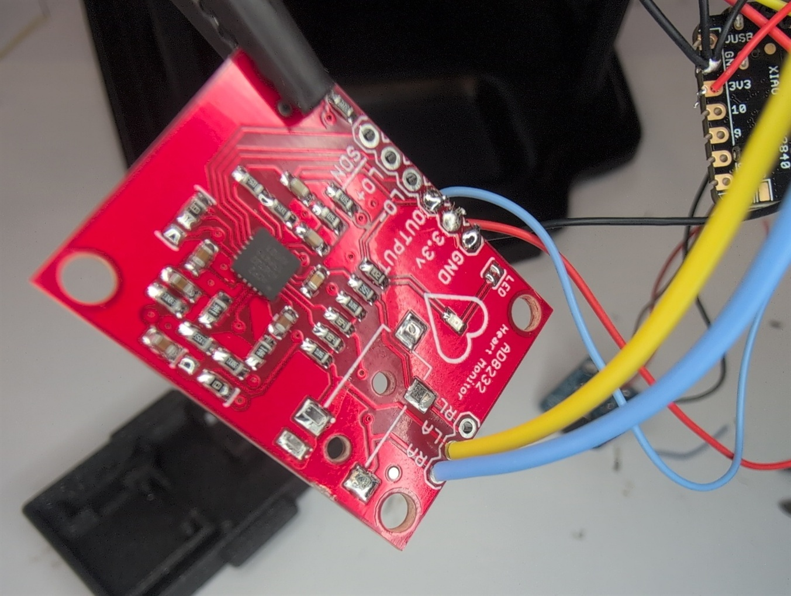

  

## Step 8. Connect the Battery

 

**Goal: Connect the Battery!**

Now it's time to connect the battery.

  ⚠️ CRITICAL SAFETY CHECK ⚠️
   
  <b>IMPORTANT: YOU MUST VERIFY BATTERY LEAD POLARITY WITH MULTIMETER</b>
   
  - RED should be POSITIVE (+)
  - BLACK should be NEGATIVE (-)
   
  <b>CAUTION:</b> Some manufacturers reverse this standard color coding.
   
  <b>⚠️ CONNECTING INCORRECT POLARITY WILL PERMANENTLY DAMAGE THE MCU ⚠️</b>
   
  With the polarity of the battery leads verified, <b>carefully solder the leads to the MCU battery contacts</b> as shown in the photo below. Here RED is positive, and BLACK is negative.

 

  

 

Accidentally soldering the leads to the wrong location (such as positive
to negative) will likely damage your board. The extent of the damage may
vary, but if this occurs the MCU should not be trusted even if it
appears to function.

Our testing has shown that sometimes the MCU will semi-function, but
other errors may present themselves in time, such as the MCU being
incapable of charging the battery.

  

## Step 9. Install Components into the Electronic Case Bottom

 

**Goal: Slot all electronic components and wiring into the electronic
case bottom.**

Now that everything is connected, it's time to install the electronics
into the case bottom.

First, position the case bottom so you're looking into it. Verify the
version number (printed on the side) is in the upper left corner. The
MCU slot should be in the upper right corner.

Install the MCU (upside down), the battery, and Vibration Motor Board.
Loop the Vibration Motor Bord wires around the upper right peg as shown
below. Likewise, the battery wires should thread through the bottom slot
of the MCU enclosure. 

 

  

 

Next, install the AD8232 Board into position. The side pins should be
located over the center of the electronic case, and the EOG/EEG (RA/LA)
pins should be towards the bottom left corner.

 

  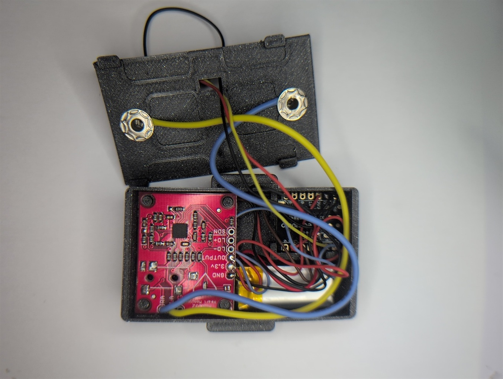

 

If the MCU is overly loose in its slot, we recommend covering it with
folded paper as shown in the figure below to ensure it remains in its
slot during use. Please note the following photos show a separate OSSMM
device printed in blue, and with thinner 30AWG wiring for the EOG/EEG
electrodes.

 

  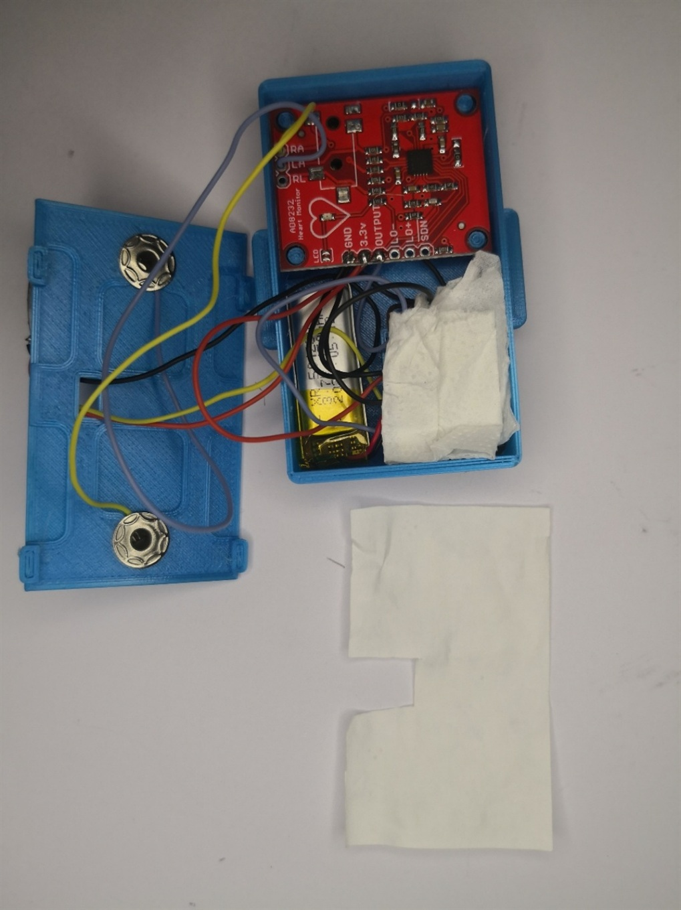

 

We also recommend installing one sheet of paper cutout as shown in the
photo below over the circuits. This provides an insulative barrier from
the metal snap-fastener electrodes and eliminates any possibility of
shorting with the underlying PCBs.

 

  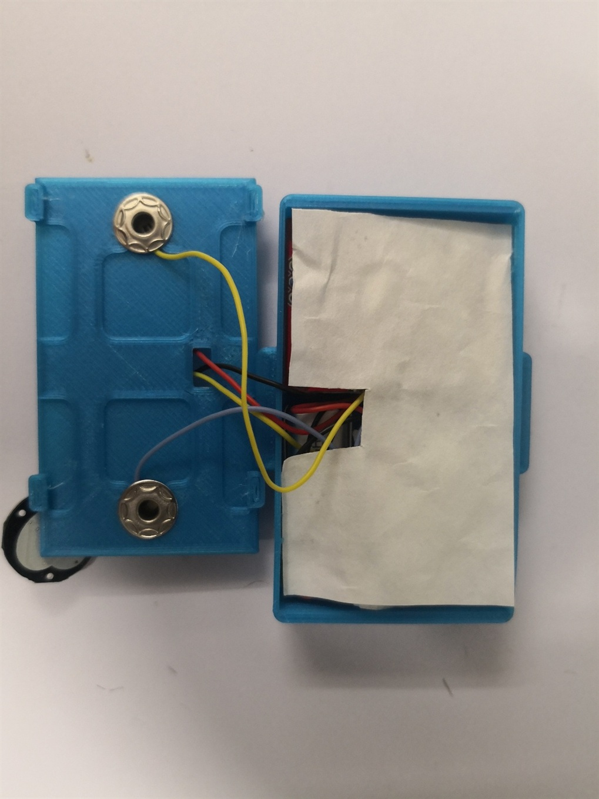

  

## Step 10. Close the Electronic Case

 

**Goal: Close the case and finish!**

Now it's time to close the electronic case. Note that the tabs on the
electronic case lid are asymmetrical. It can only be closed in one way!

Before inserting, make sure the respective slots on the electronic case
bottom are free and clear. Remove any debris or support material which
may remain.

Align the tabs, insert on one side, then insert on the other. This may
require some slight bending of the electronic case walls to allow the
tabs to slip into their slots.

When it is finished it should look like the following:

  
<strong>Back:</strong>

  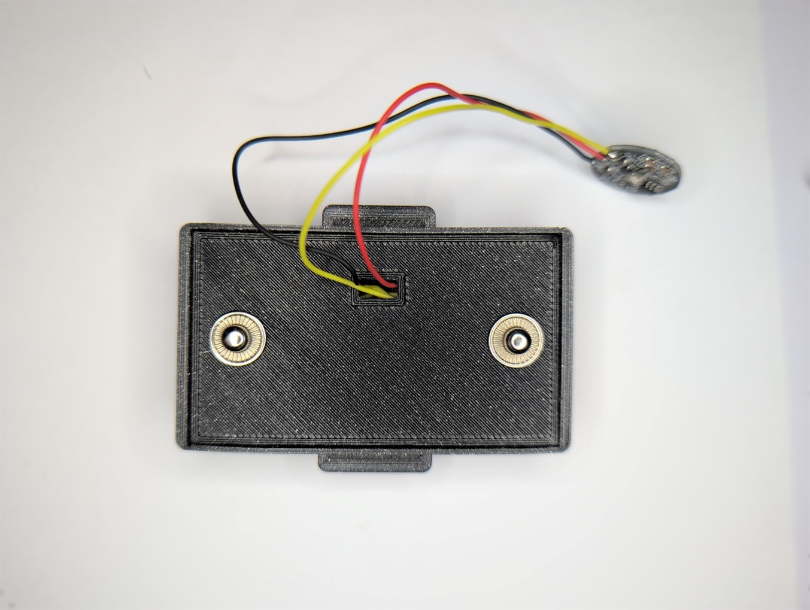

  
<strong>Front:</strong>

  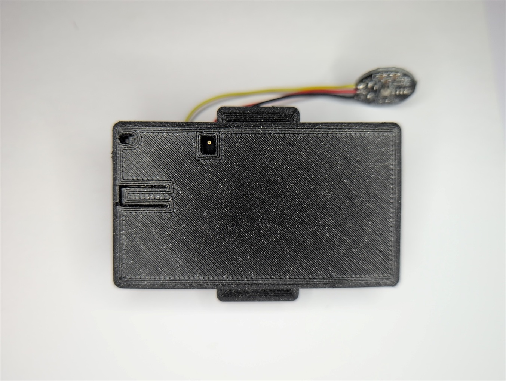

  
<strong>Side with USB-C:</strong>

  

  

## Step 11. Now Time for Full Assembly!

 

Refer to the assembly guide below on how to combine the heart monitor strap,
receiver and electronics module together! You're nearly finished!

**[Final Assembly](04-final-assembly.md)**: Integrating the electronics into the casing and attaching the headband.

or alternatively, return to the main page: **[Main Page](index.md)**

  

## Additional Information on the AD8232

 

*Regarding the removal of the 3.5mm jack, one of the project goals was
to minimize the size and weight of the OSSMM device. Under this lens,
the 3.5mm jack provides no benefits and consumes precious space
resources.*

*For those familiar with the AD8232, no connection to the RL pin indeed
means the Right Leg Drive Amplifier (RLD) is not used. Typically, the
RLD applies a small current which is inverse to the signal commonly
detected by both the RA and LA electrodes. Because the AD8232 acts as a
differential amplifier in this case, applying the inverse of the common
signal improve improves the Common-Mode Rejection Ratio, or in short,
improves the Signal to Noise Raise (SNR) of the signal difference
between the electrodes.*

*We accept the trade-off of reduced signal quality by abandoning the RLD
for two principal reasons: perceived safety and constructability. Having
any current applied to the body, particularly the head, is considered
invasive and therefore makes any risk however infantisemly negligible\*,
non-zero. Furthermore, the requirement for a third electrode to supply
this current to the body increases device costs and device complexity.
The perfomance of the OSSMM without the RLD is more than sufficient to
gladly accept this trade-off.\
\
\*To be very clear on how safe the RLD already is, please consider the
following: The AD8232 EKG board in its standard "Cardiac Monitor
configuration," which is used here prior to "safety" modification, is
set with an "RL" output resistor of 360kΩ limiting the output current to
a participant's body of ≤ 10 µA, provided the PCB voltage is 3.3V. In
the worst case scenarion, even if the voltage were raised to 4.2V (i.e.
directly powered by a fully charged 3.7V LiPo battery, which it is not)
and the resistor had the lowest value within the ±10% tolerance range
(that is 324 KΩ), the maximum current would be 13 µA. In comparison,
tACS and tDCS devices supply current to a participants head of up to
2mA, or more than 150x the worst case scenario of the AD8232. However,
given that there is still a "risk" using the RLD, this would needlessly
complicate Health&Safety assesments and ethics approval.*